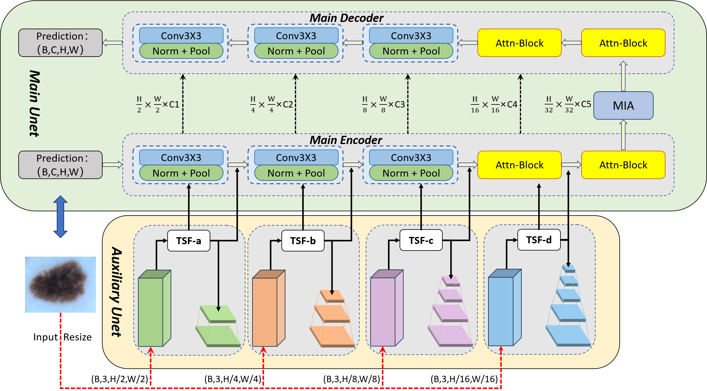
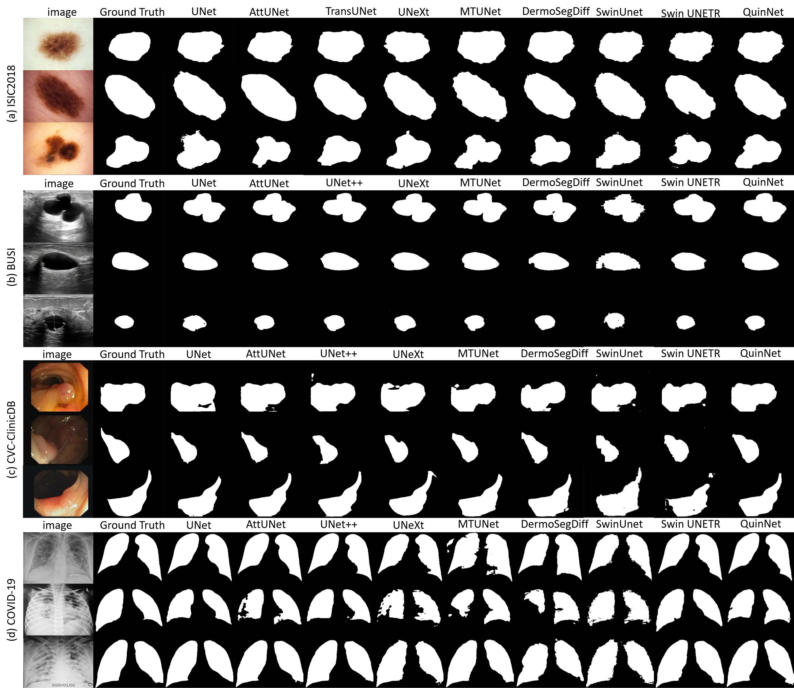
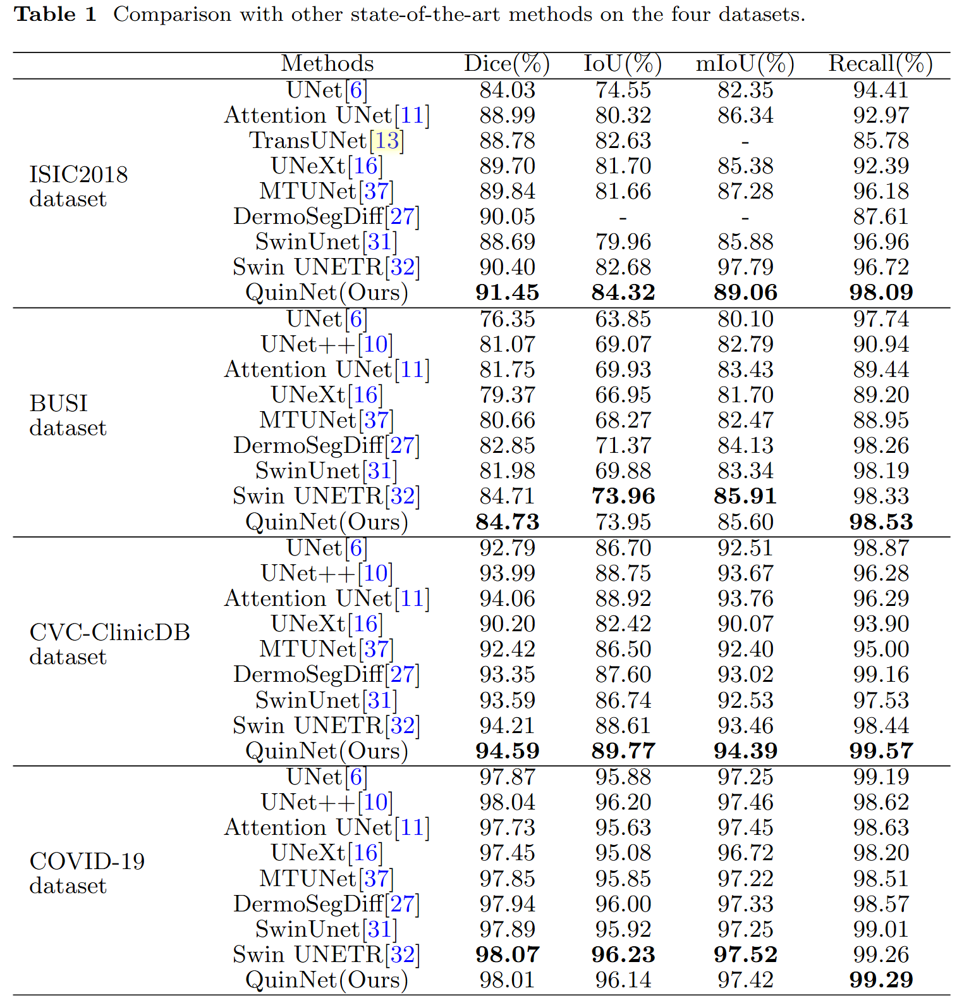

# QuinNet: Quintuple U-shape Networks for Scale- and Shape-variant Lesion Segmentation
Official Pytorch Code base for "QuinNet: Quintuple U-shape Networks for Scale- and Shape-variant Lesion Segmentation".

## Introduction
Deep learning approaches have demonstrated remarkable efficacy in medical image segmentation. However, they continue to struggle with challenges such as the loss of global context information, inadequate aggregation of multi-scale context, and insufficient attention to lesion regions characterized by diverse shapes and sizes. To address these challenges, we propose a new medical image segmentation network, which consists of one main U-shape network (MU) and four auxiliary U-shape sub-networks (AU), leading to Quintuple U-shape networks in total, thus abbreviated as *QuinNet* hereafter. MU devises special attention-based blocks to prioritize important regions in the feature map. It also contains a multi-scale interactive aggregation module to aggregate multi-scale contextual information. To maintain global contextual information, AU encoders extract multi-scale features from the input images, then fuse them into feature maps of the same level in MU, while the decoders of AU refine features for the segmentation task and co-supervise the learning process with MU. Overall, the dual supervision of MU and AU is very beneficial for improving the segmentation performance on lesion regions of diverse shapes and sizes. We validate our method on four benchmark datasets, showing that it achieves significantly better  segmentation performance than the competitors. 
<p align="center">
  
</p>

## Using the code:
The code is stable while using Python 3.8.3, CUDA >=11.8.
- Clone this repository:
```bash
git clone https://github.com/Truman0o0/QuinNet.git
cd QuinNet
```
- To install all the dependencies using conda:
```
conda create -n unext python=3.8.3 -y
conda activate QuinNet
conda install pytorch torchvision torchaudio pytorch-cuda=11.8 -c pytorch -c nvidia
pip install -r requirements.txt
```

## Datasets
1) ISIC 2018 - [Link](https://challenge.isic-archive.com/data/)
2) BUSI - [Link](https://www.kaggle.com/aryashah2k/breast-ultrasound-images-dataset)
3) CVC-ClinicDB - [Link](https://www.dropbox.com/scl/fi/ky766dwcxt9meq3aklkip/CVC-ClinicDB.rar?rlkey=61xclnrraadf1niqdvldlds93&e=1&dl=0)

After downloading these datasets, please divide them strictly according to the instructions in our paper.

## DataFormat
Make sure to put the files as the following structure:
```
dataset
├── ISIC2018
|   ├── Training_GroundTruth
|   │   ├── ...
|   │
|   ├── Training_Input
|   │   ├── ...
|   │
|   ├── Validation_GroundTruth
|   │   ├── ...
|   │
|   └── Validation_Input
|       ├── ...
|
├── BUSI
|   ├── train
|   │   ├── ...
|   │
|   └── val
|       ├── ...
|
├── CVC-ClinicDB
|   └── PNG
|       ├── Ground_Truth
|       |   ├── ...
|       |
|       └── Original
|           ├── ...
|
└── COVID-19
    ├── images
    |   ├── ...
    |
    └── masks
        ├── ...
```

## Training and Validation
### 1) Train the model.
```
# python train.py --dataset ISIC2018 --arch QuinNet --name ISIC2018 --img_ext .jpg --mask_ext .png --lr 0.0001 --epochs 200 --input_w 512 --input_h 512 --b 8  
python train.py --dataset <dataset name> --arch QuinNet --name <exp name> --img_ext .png --mask_ext .png --lr 0.0001 --epochs 200 --input_w 512 --input_h 512 --b 8
```

### 2) Test.
```
# <exp name> - ISIC2018
python val.py --name <exp name>
```
The result will be saved in `outputs/<exp name>`.
<p align="center">
  
</p>

### 3) Evaluation.
<p align="center">
  
</p>
